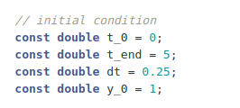

# ODE Solver
Idea contributed by Gerasimos Chourdakis <chourdak@in.tum.de> and Hasan Ashraf <ashraf@in.tum.de>.

## Motivation

In this project we aim to build a solver for [Ordinary differential equations](https://en.wikipedia.org/wiki/Ordinary_differential_equation) which are widely used in scientific computing for simulation real world phenomena. 
Here we solve the ODEs using two solvers namely [Explicit Euler scheme](https://en.wikipedia.org/wiki/Euler_method) and [Implicit Euler scheme](https://en.wikipedia.org/wiki/Backward_Euler_method).

## How to use the solver

You can define the function for which you want an approximate solution in `double y_dot(double t, double y)`, we take the example of Dahlquist’s test equation for a test case. 

You can set the initial conditions `y0`, as well as other conditions like `t0`, `t_end`,`dt` in the `main()` section as shown below

We define the Explicit and Implicit solvers as separate classes `class Explicit_solver` and `class Implicit_solver`. More solvers can be added in a similar way.

## Result Table
Explicit Euler Method

Implicit Euler Method

## Roadmap

### Sprint 1
In this sprint, you need to implement an [explicit Euler scheme](https://en.wikipedia.org/wiki/Euler_method).
You will write unit tests, so that you can later refactor your code,
without worrying that you change the results of it.
You do not need to use classes, you can write plain functions. But
the architecture is up to you, feel free to experiment.

#### Definition of "done"
- The project contains a comprehensive `README.md` file explaining how to use it, including an example.
- The user can give an ODE to solve, either at runtime (e.g. with `std::function`/lamda, if you know what this is already) or specify it directly in the code. Any additional parameters (e.g. the time step value) can be provided in any way.
- The solver prints or returns an `std::vector` of the solution.
- The project contains at least one unit test which compares one case with its analytic solution for correctness.

### Sprint 2
In this sprint, you need to extend your solver to be able to use different schemes,
such as an [implicit Euler scheme](https://en.wikipedia.org/wiki/Backward_Euler_method). To achieve this, you need to encapsulate your discretization scheme / solver into a class, deriving from an abstract base class, which all the schemes should share. The main() function should not directly call the specific solver, but it should access it through an interface common to all solvers. The scheme should be configurable at runtime, either through keyboard input or through a configuration file. The results should be written in a file.

#### Definition of "done"
- The user can select different ode solvers / schemes at runtime.
- Every solver should give correct solutions for provided examples. All these examples should be accompanied by unit tests.
- The solvers should be using the same class interface.
- The `README.md` file should explain how one could extend the code to include a new solver.
### Sprint 3

In this sprint, you need to study and improve the performance of your code.
Select at least three different scenarios to investigate the performance of your code.
Find potential performance bottlenecks (e.g. using a profiler such as gprof) and investigate optimization options for your code, including loop transformations, STL containers and algorithms, and vectorization options. You may also try other parallelization techniques, if you already know of any, but we encourage you to focus on the elements discussed in the lecture.

#### Definition of "done"
- A file `performance.md` presents your observations from the performance analysis.
- The same file presents at least three different optimization techniques you applied, with the performance effects you observed.
- The final code should include the (in your conclusion) most optimized version of your code.
